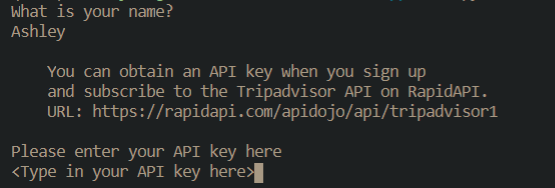
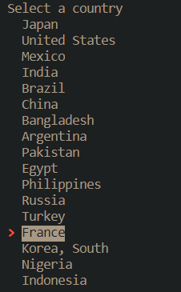
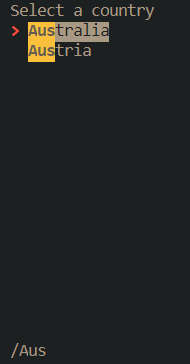
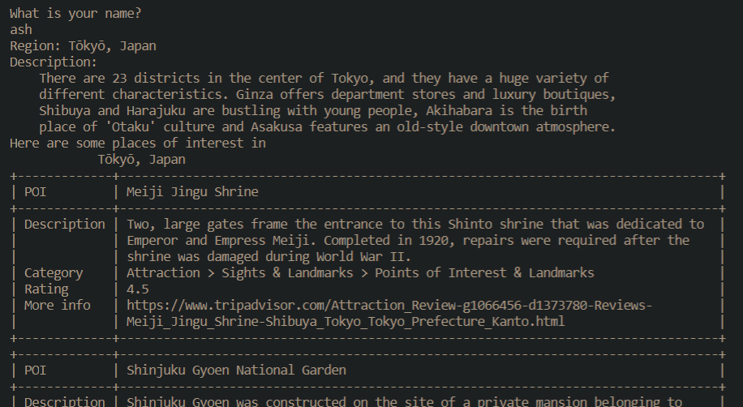
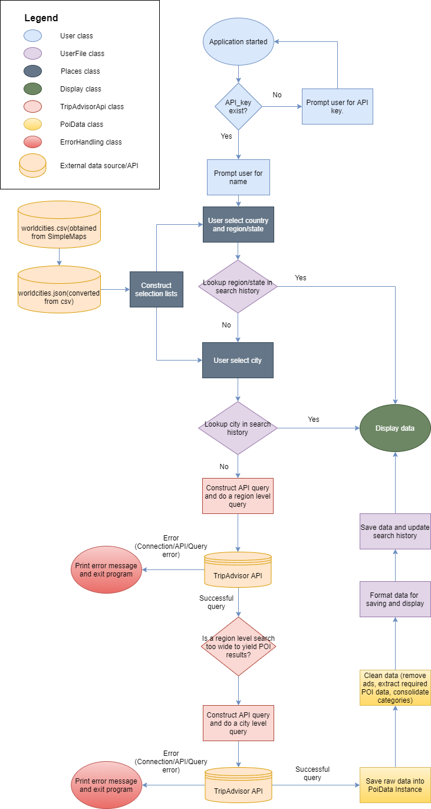

# Terminal application name: Travelapp

## User Guide
### Installing Requirements and obtaining API key
In order for this application to run:-
1. Ensure you have Python 3.8 and python3.8-venv installed on your system.
2. Clone the application onto your system from https://github.com/ashley190/travelapp
3. Navigate to the travelapp folder and activate the python3.8 virtual environment.
4. Install application dependencies within the Python3.8 virtual environment by running `pip install -r requirements.txt` on your terminal.
5. Sign up for a RapidApi account and log into your account at https://rapidapi.com/apidojo/api/tripadvisor1
6. Subscribe to the TripAdvisor Api and select the free basic plan. Once subscribed, the 'Subscribe to Test' button on the TripAdvisor Api page will turn to 'Test Endpoint' and your API key can be found in the field 'X-RapidAPI-Key' field. You will need this key within the application.
7. Ensure that your terminal size is at least 100 columns wide. You can use the command `tput cols` in your terminal to see the width of your terminal in columns.

### Running the application
1. Run the command `python main.py` on your terminal.
2. You will be prompted to enter your name. This is the name where your searches will be saved under and retrieved from when you use travelapp in the future. Ensure that you enter the same name when you use the the application next time if you would like to retrieve and view your past searches.

    
3. Once you entered your name, if you do not already have an API key saved, you will be prompted to put in an API key. Enter in your API key when prompted (without quotemarks). The application will then store it as a persistent environment variable in the *src/.env* file.
    
4. Once the API key has been saved, you will be presented with a selection menu to select a country. You can navigate this menu using the up and down arrow keys on your keyboard or type in your preferred country by starting you search with a '/'. The list will narrow down to the available items as you type. 

     .
5. Once that is completed, you will be prompted to select a region/state and city(if required). The steps for selection for region/state and/or city is identical to step 4.
6. Once the selection step is completed, the application will attempt to:-
    - Search through your past saved searches for your selected location. If found, it will display the available information along with a list of places of interest(POIs) in your selected location.
    - If the selected location is new then an API query will be constructed and sent to TripAdvisor API. If the query is successful, the search data will be saved for future reference and displayed in the same format as above.
        
    - If the search is not successful, the application will exit and the error message will be printed on your terminal.
        

### Troubleshooting
If you encounter problems with the application, try the following:-
1. Check if you have installed the correct version of python as detailed in the "Installing Requirements and obtaining API key" section above.
2. Check the src/.env folder to ensure that you have the correct API_key saved. You can use the  `cat src/.env` command on your terminal. If your key is incorrect, you can remove the file using `rm src/.env` command and run the app to save your API key again. 
3. Check if you have a working internet connection.
4. Check if you are subscribed to the TripAdvisor Api on RapidApi. It is not enough to just sign up and be logged in, a free basic subscription is also required for access to the API.

## File Structure
- [README](README.md) - Contains all project documentation. This includes the user guide, software development plan and project implementation documents.
- [docs](docs) - contain all images and resources referenced on README.
- [.github](.github) - contain the YAML file that outlines the CI/CD pipeline of this project.
- [src](src) - contain the source code and automated tests for the Travelapp application.
    - [main.py](src/main.py) - main file for running the terminal app program.
    - [users.py](src/users.py) - contains the User class.
    - [userfile.py](src/userfile.py) - contains the UserFile class.
    - [places.py](src/places.py) - contains Database and Place classes.
    - [get_poi.py](src/get_poi.py) - contains the TripAdvisorApi class.
    - [poi_data.py](src/poi_data.py) - contains PoiData class.
    - [file_handler.py](src/file_handler.py) - contains classes for handling Csv, Json and Conversion of files.
    - [display.py](src/display.py) - contains Display class
    - [helpers.py](src/helpers.py) - contains helper classes and methods for a variety of purposes.
    - [resources](src/resources) - contains application resources such as the worldcities database in csv and json as well as user searches (stored under directories named using user's name)
    - [tests](src/tests) - contains automated tests for application.
- [development-log.md] - Developer's log during app development.
- [requirements.txt](requirements.txt) - list of application dependencies that can be installed by running `pip install -r requirements.txt`.

## Software Development Plan - Travel Application
### Purpose
Travelapp is an application that helps retrieve, save and display information about travel locations or points of interest. It utilises the TripAdvisor API for travel information. It helps users to search and view information on places of interest at a region/city level to help make travel decisions. 

### Application Features
- Feature 1: Obtain user info and API_key. Stores and reference the API key as a persistent environment variable.
- Feature 2: Generates user selection menu for countries, regions/states and cities for users to enter their place of interest. List of countries, regions and cities are based on the worldcities.csv file created by SimpleMaps that is converted to Json and structured to generate a user navigable selection menu (using the simple-term-menu external module)
- Feature 3: Based on user's selection, the program looks through past searches for a match. If that location has been searched before, data will be retrieved and displayed (No outbound requests made).
- Feature 4: If data does not exist in a user's search history, API queries will be constructed and sent in the following manner:-
    1. A regional level location query to obtain a region's location_id
    2. Using the region's location_id, construct and send another query to obtain POIs within the region. 
    3. Responses resulting from the API queries are processed for errors. Travelapp handles the following errors:-
        - There are instances where a region level search is too wide(especially for large countries) and the API returns and error in its response. If this happens, steps 1 and 2 are repeated at a city level to obtain points of interests for a particular city.
        - Connection/API related errors will result in the error message printed out for the user and the application will exit as it can no longer meaningfully proceed.
- Feature 5: Responses resulting from successful queries are cleaned, consolidated and formatted into a displayable format. This format is then saved into the user's search history (for future reference) and displayed. There will be a region/city summary at the beginning of the display followed by POI information displayed in individual tables for each POI.

### Application logic chart

The above application logic chart is color coded to represent the objects used to perform the different functionalities throughout the flow of the application.

## Software Implementation Plan

The implementation of the Travelapp application was based around the features defined under "Application Features".

### Planning and resource gathering
The first three days were spent on searching for a suitable API for travel queries and creating test queries and analysing the responses. After deciding on the suitable (and free) API, plans were made on how to construct queries for the TripAdvisor API that requires a location to begin search. 

### Set up project on Github and CI workflow
Along with the resource gathering phase, the project was initialised on GitHub and a Continuous Integration(CI) workflow was written for several tasks to be automated upon pushing code from a local development environment into GitHub. Tasks include:-
    1. Running automated tests on code
    2. Style check using flake8
    3. Type hinting checks using mypy.
These tasks ensure that good quality code was being integrated with the source code on GitHub.

### Code planning
Planning have to be made around the method to obtain user's input when it comes to city selection to minimise errors usually introduced by manual typing. A database of cities was found on SimpleMaps to construct a selection menu for user selection with a good representation of 15000 cities/places around the world. 

As csv format was unfamiliar, the database was converted into a json format before being utilised by the application. A user-friendly selection menu was created for countries, regions and cities in 2 days after the main csv database was found.

Once the user selection menu was up and running, further planning was made for other features centered around the search and display feature of the application before concluding on the MVP with features specified in "Application Features"

### Actual coding
A majority of the coding work went into creating the user selection menu, breaking down API responses into meaningful data as well as bug fixes as new features were implemented. The coding workflow that was employed included:-

1. Deciding where and how to implement feature in OOP i.e. how to structure modules and classes and functions.
2. Continuously test functionality of new feature
3. Fix bugs as they arise and keep on top of styling checks.
4. Continuously pushing code to GitHub and fix errors when found.

### Automated testing
Automated testing were written initially along with code up to the point that the user selection menu was implemented. After that, tests were written after coding of the app was complete in order to identify crucial features/ code within the app to test. Automated tests took 3 days to complete after the MVP was completed.

### Documentation
As a way of checking code, documentation and type hinting were completed once the MVP and automated tests were completed. This allowed the developer to go over all the code for both documentation purposes and review.

### Writing CD workflow
Once code documentation and project documentation was completed, CD workflow is written for deployment into an AWS EC2 instance.

## Resources/ References: 
1. worldcities.csv by Simple Maps available at https://simplemaps.com/data/world-cities under a Creative Commons Attribution 4.0.